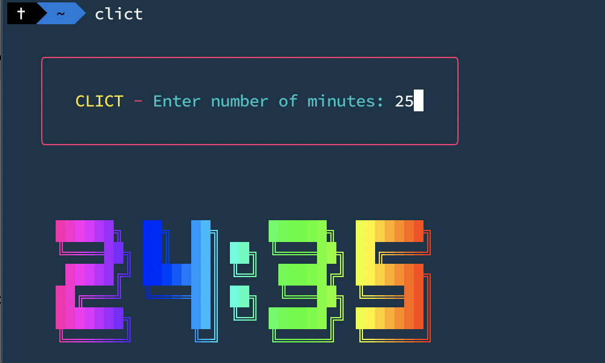

# CLICT - CLI Countdown Timer



A CLI countdown timer built using [INK](https://github.com/vadimdemedes/ink), which lets you use [React](https://reactjs.org/) components to build command line apps.

Note: This currently only works on macOS.

## Install

```
$ npm i -g clict
```

## Usage

```
$ clict
```

Enter the number of minutes for the countdown. When time runs out, the computer will speak "Time's up."

## Changes

You can install the package locally and make changes. To run the modified version:

```
$ npm run build
$ node dist/clict
```
